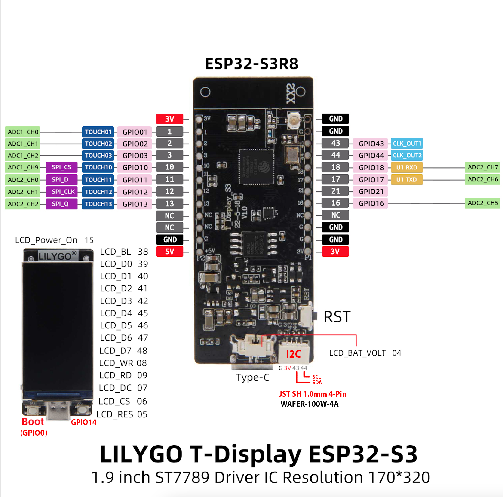

# Learning Embedded Development on ESP32 (S3R8)

My personal journey into embedded development with Lilygo T-Display S3 Microcontroller

- [Rotary Encoder](./esp32/rotary-encoder)
- [Line Tracking Sensor](./esp32/line-tracking-sensor)

## Instructions

Install `esp32` [toolchain](https://github.com/esp-rs/rust-build):

```bash
cargo install espup
cargo install ldproxy
cargo install espflash
espup install
```

> Note: `espup` requires `python3` to be installed

<details>
  <summary>Pinout Diagram</summary>

  
</details>