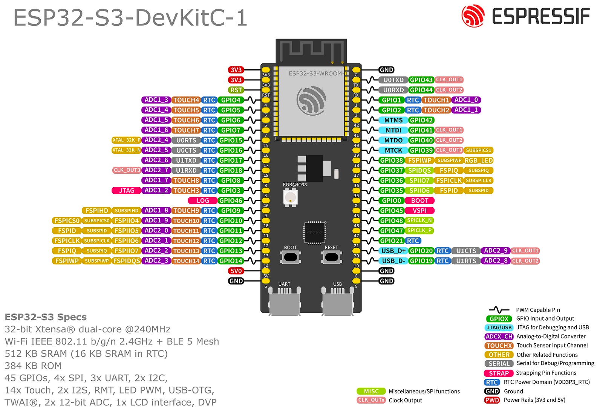

# Learning Embedded Development on ESP32

My personal journey into embedded development with a `ESP32-S3` Microcontroller

- [Rotary Encoder](./esp32/rotary-encoder)
- [Line Tracking Sensor](./esp32/line-tracking-sensor)
- [Passive Buzzer](./esp32/passive-buzzer)
- [Micro SD Card](./esp32/micro-sdcard)
- [Capacitive Switch (Touch Sensor)](./esp32/capacitive-switch)
- [Accelerometer (ADXL345)](./esp32/accelerometer)
- [Motor Driver (DVR8833)](./esp32/motor-driver)
- [8x8 Matrix (MAX7219)](./esp32/matrix)

## Instructions

Install `esp32` [toolchain](https://github.com/esp-rs/rust-build):

```bash
cargo install espup
cargo install ldproxy
cargo install espflash
espup install
```

> Note: `espup` requires `python3` to be installed

<details>
  <summary>Pinout Diagram</summary>



## LilyGo T-Display S3

</details>