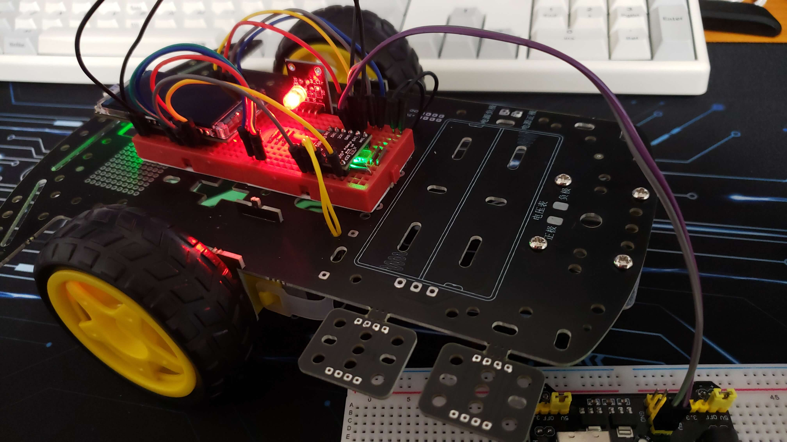
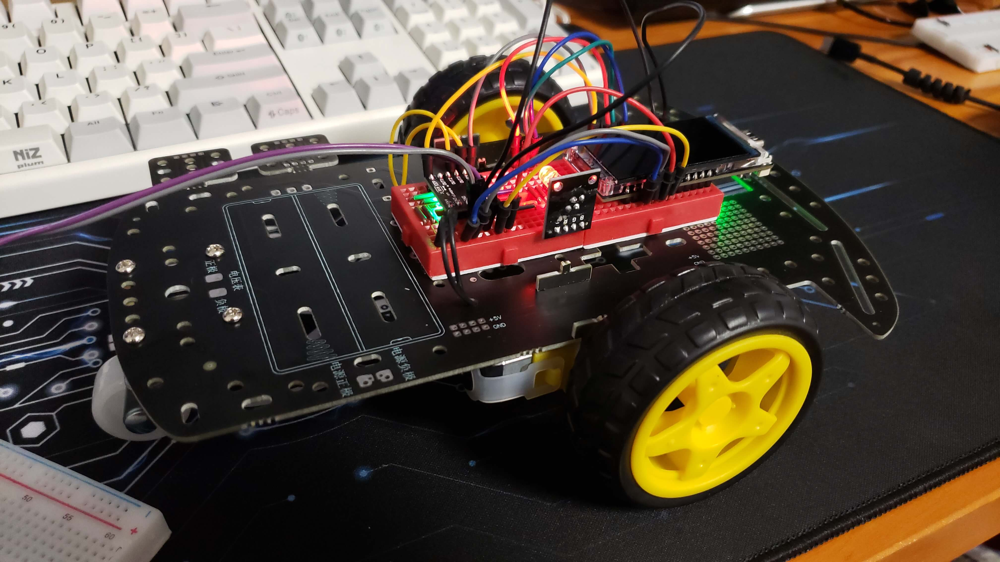
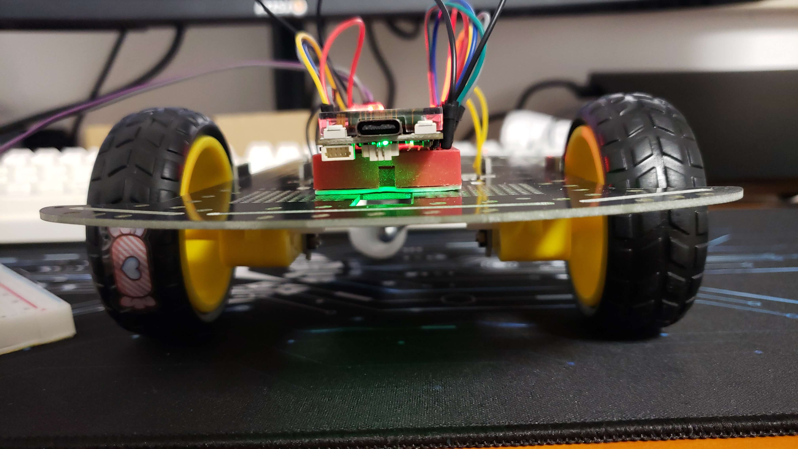
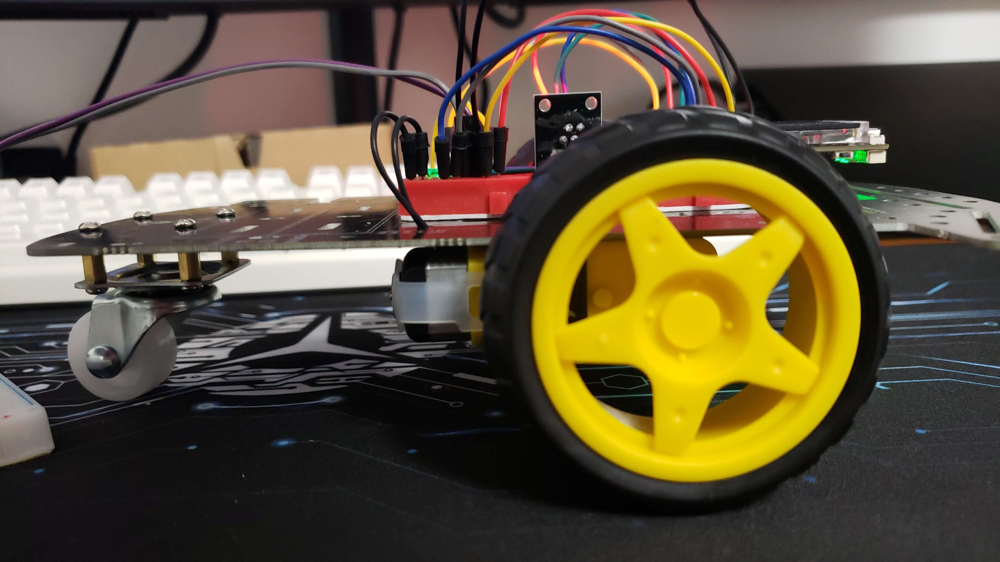

# Motor Driver

https://github.com/milewski/sensors-esp/assets/2874967/406fdfb9-3e7d-41e8-9e37-72107ab843b8

> The original kit was intended to be done with a `STC 89C5RC` microcontroller, and probably written in C? Arduino? 
> but I have used an `ESP32` and `Rust` instead for simplicity.

<details>
    <summary>Images</summary>
    




</details>

### Features

- Use a `Lily-Go T-Display S3` board to control a car with 2 motors and a caster wheel.
- The car is controlled by a `DVR8833` motor driver, which is controlled by the `ESP32` using `PWM` signals.
- The companion app sends `BLE` commands to the `ESP32` to control the car.
- The companion app is written in `Flutter` and can be found [here](./remote-control).
- The RGB LED goes green when the bluetooth is connected, and red when disconnected.
- THe RGB LED blinks yellow when the motor-drive detects a short circuit / over current / over temperature etc...

### Components

- Motor Driver (DVR8833)
- A RGB LED
- 2x Motors (Which I have no idea about its specs)
- A mini power supply (HW-131)
- An Lily-Go T-Display S3
- 2x wheels
- 1x caster wheel
- 1x PCB car chassis (although I'm not using the printed circuit that came with it)
- Wires

### How to Run

To run the example, use the following command:

```bash
cargo run -p motor-driver
```

### Notes

- When using a `Lily-Go T-Display S3` board the pin 15 needs high to be able to power it from the 5v pin instead of USB.
